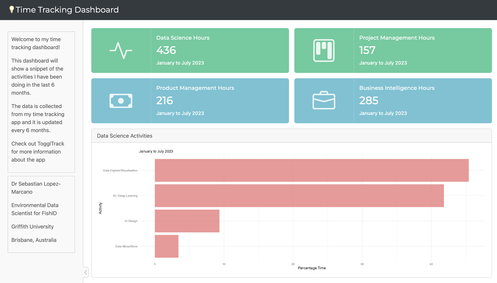

# Seabass Time Tracking Dashboard
I have been time tracking my work hours for the past 2 years. The purpose was to provide clear, and real data to my supervisors and to develop more accurate business intelligence. For example: how much time does it take to complete a task, how much time does it take to complete a project, how much time does it take to complete a project with a specific client, etc.

I have been using Toggl to track my time. Toggl is a free time tracking software that can be used on the web, desktop, and mobile. It is very easy to use and it has a lot of features. I have been using the free version for the past 2 years and it has been more than enough for my needs.

Using the Toggl dataset, I have been able to create a dashboard that shows my time tracking data.

The dashboard displays the totaly hours from Jan to July 2023 spent across my 4 key activities. 

# July 2023 version

